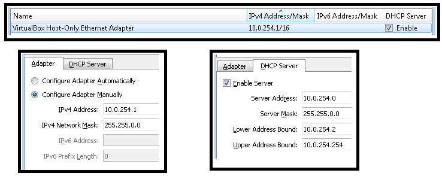

# NMOS Scalability

This repository establishes a test environment for investigating [NMOS](https://github.com/AMWA-TV/nmos) Scalability using the [Mininet](https://github.com/mininet/mininet/) network rapid prototyping tool.
Mininet emulates a complete network of hosts, links, and switches on a single machine.
We extend Mininet with functions to build large-scale networks of NMOS Registries and Nodes.

## Study Findings

For an overview of this study and its conclusions, watch the presentation ["Scalability and Performance of the AMWA IS-04 and IS-05 NMOS Specifications for Networked Media"](https://www.youtube.com/watch?v=vuwJWtVGvss) given at the [SMPTE 2018 Annual Technical Conference](https://www.smpte.org/news-events/events/smpte-2018-annual-technical-conference-exhibition).

A paper describing the study and initial results is also freely available at https://ieeexplore.ieee.org/document/8610041, thanks to the Society of Motion Picture and Television Engineers.
An updated version with additional material is to appear in the July 2019 issue of the SMPTE Motion Imaging Journal.

Other presentations:

* [IP Showcase](http://www.ipshowcase.org/) at IBC 2018: [video](http://www.ipshowcase.org/2018/11/07/video-is-04-and-is-05-scalability/), [presentation](http://www.ipshowcase.org/wp-content/uploads/2018/11/Rob-Porter-AMWA-NMOS-IS-04-and-IS-05-Scalability-and-Performance.pdf)
* IP Showcase at NAB 2019: [schedule of events](http://www.ipshowcase.org/theater-schedule-nab-show-2019/)

The contents of this repository are [licensed](LICENSE) under the terms of the Apache License 2.0.

## Test Environment Setup

The following instructions describe how to prepare the basic environment.

Mininet can be run under a variety of virtualisation programs.
These instructions are tailored to use Oracle VM VirtualBox Manager 5.1 or 5.2 on Windows.
(To use other virtualisation programs, see http://mininet.org/vm-setup-notes/ and adapt the setup accordingly.)

## VirtualBox Network Setup


### Host-Only Interface

For scalability testing we require several thousand IP addresses for the hosts under Mininet.
We have reserved the lower part of the 10.0/16 IP address range for this purpose.
This has been achieved by setting up the 10.0/16 range as a Host-Only interface with part of this range (10.0.254.xx) used for DHCP for the host computer and virtual machine interfaces on this network.
This allows communication between:
- Host computer
- Virtual machines
- Mininet hosts running on a virtual machine (needs additional configuration, for which see later)

#### Host-Only Adapter Configuration

- To configure from VirtualBox Manager GUI
  - *File -> Host Network Manager...*

    

- Alternatively configure from the command line as follows:
  - Modify the existing default Host-Only Ethernet adapter  
    ```winbatch
    VBoxManage hostonlyif ipconfig "VirtualBox Host-Only Ethernet Adapter" --ip 10.0.254.1 --netmask 255.255.0.0
    ```
  - Set the host-only DHCP server to use the 10.0.254.xx address range  
    ```winbatch
    VBoxManage dhcpserver modify --ifname "VirtualBox Host-Only Ethernet Adapter" --ip 10.0.254.0 --netmask 255.255.0.0 --lowerip 10.0.254.2 --upperip 10.0.254.254 --enable
    ```

#### NAT Adapter Configuration

The default NAT adapter address clashes with the host-only adapter configuration assigned above. The NAT adapter address needs to be modified.
This has to be applied to each VM used. (This NAT adapter configuration is performed automatically in the `ImportVM` script described below.)

## Set Up The Mininet Virtual Machine

### Download the 64-bit Mininet VM Image

Grab it from this link: https://github.com/mininet/mininet/releases/download/2.2.2/mininet-2.2.2-170321-ubuntu-14.04.4-server-amd64.zip, and expand the archive.

### Configuration Notes

* Increase the amount of memory and CPUs used by the VM

  More memory and more CPUs are better (default is 1024 MB and 1 CPU).
  On our primary test machine, to simulate networks with several thousand NMOS Nodes, we used 40 GBytes of memory and 12 CPUs, but it's certainly possible to run many tests with fewer.

* Guest Additions

  Installing the Guest Additions to the VM adds facilities to improve the user experience, such as an easy way to add shared folders and mouse pointer integration if running with a GUI.

### Import the VM into VirtualBox

The Mininet VM can be imported via the VirtualBox GUI or via the VirtualBox command line.
Scripts exist in this repository to simplify the importing and set up of the Mininet VM.

#### To import the VM by using the nmos-scalability script

##### Fetch the Import VM Script

  * Fetch the [`nmos-scalability\install\ImportVM.bat`](install/ImportVM.bat) batch file

##### Run The Script

  * Optionally, to change the default 1 CPU and 1024MB of memory settings, first set the following environment variables to appropriate values for your system:  
    ```winbatch
    set NMOS_MININET_CPUS=12
    set NMOS_MININET_MEMORY=40000
    ```
  * Optionally, to set up a shared folder, set the following environment variable to the folder to be shared:  
    ```winbatch
    set NMOS_MININET_SHARED_DIR=C:\PathTo\DirToShare
    ```
    * In this case the shared directory will be found on the VM at `/media/sf_DirToShare`.
      If you wish to change the name to be appended to the prefix `/media/sf_`, set the following environment variable as well:  
      ```winbatch
      set NMOS_MININET_SHARED_DIR_NAME=AlternativeName
      ```
  * Call the `ImportVM.bat` batch file to import the VM, passing it the `.ovf` file from the Mininet archive you downloaded:  
    ```winbatch
    ImportVM.bat <Mininet-VM .ovf file>
    ```
    * The above line will import the Mininet VM with the default VirtualBox name, `Mininet-VM`.
      If additional VMs are required, or you wish to change the name used by VirtualBox for this VM, pass the name as a second parameter to the script.
      (Avoid the use of the underscore character if you wish to use the same name as the VM hostname.)  
      ```winbatch
      ImportVM.bat <Mininet-VM .ovf file> <Alternative-VM-Name>
      ```
  * Once imported, the batch file will prompt you to press Enter to start the VM.

#### Alternatively import using VirtualBox GUI

To import the VM manually from the GUI, or to check the VM configuration settings from the GUI, see [this page](docs/VirtualBoxImportFromGUI.md).

## Configuring the Mininet VM

The Host-Only DHCP server allocates the IP addresses starting from 10.0.254.2.
If this is the first VM started using this host-only interface it will have this first address.
This can be verified using `ping`:

```winbatch
ping 10.0.254.2
```

The following procedure uses `scp` (secure copy) and `ssh` (secure shell).
These tools are natively available on a Windows 10 platform if *Developer mode* is enabled in *Update and Security -> For developers*.
Alternatively `putty` and its secure copy, `pscp`, can be used.

The [`nmos-scalability/install`](install) directory contains Linux scripts to further configure the Mininet VM for Mininet with our NMOS extensions.
We first need to transfer these onto the Mininet VM.
* Download this repository as an archive: https://github.com/AMWA-TV/nmos-scalability/archive/master.tar.gz
* Now use `scp` to transfer this onto the VM:  
  ```winbatch
  scp nmos-scalability-master.tar.gz mininet@10.0.254.2:/home/mininet/nmos-scalability-master.tar.gz
      <accept key (if first login)>
      <enter password 'mininet'>
  ```
* Now login to the Mininet VM:  
  ```winbatch
  ssh mininet@10.0.254.2
      <enter password 'mininet'>
  ```
* Expand the archive that was transferred via `scp`:  
  ```bash
  tar xvzf nmos-scalability-master.tar.gz
  mv nmos-scalability-master nmos-scalability
  ```

* If working behind a proxy server, set the environment variable `VM_PROXY_SETTINGS` to indicate the setting to use.
  * If `cntlm` is already set up on the host computer, this can be utilised via the NAT network.
    Check the port number used by your host `cntlm` as this can vary from the default 3128 used in this example.
    (10.10.0.2 is the default gateway of the VirtualBox internal NAT network after the address change in the `ImportVM` script.)  
    ```bash
    export VM_PROXY_SETTINGS=http://10.0.254.1:3128
    ```
  * Alternatively, the authentication can be specified along with your proxy server directly, as in this example.
    (Note the authentication in this case will be stored on the VM in various places, see the script [`nmos-scalability/install/SetProxies.sh`](install/SetProxies.sh) for where.)  
    ```bash
    export VM_PROXY_SETTINGS=http://<username>:<password>@proxy.example.com:10080
    ```
* Run the `SetupPart1.sh` script, optionally passing in a new name for the VM (e.g. lowercase version of VirtualBox name to follow the default naming convention).  
  ```bash
  nmos-scalability/install/SetupPart1.sh mininet-vm01
  ```
* You will be prompted to press enter to reboot. Log in again:  
  ```winbatch
  ssh mininet@10.0.254.2
      <enter password 'mininet'>
  ```
* If you specified a new name, this should have now changed.
  Verify internet access is available, e.g. with:  
  ```bash
  wget www.google.com
  ```

* Run part 2 of the setup:  
  ```bash
  nmos-scalability/install/SetupPart2.sh
  ```
* This takes about 40 minutes or so to complete building and setup.
  When completed you will be prompted to reboot again.

## Optional Additions

[This page](docs/VirtualBoxOptionalAdditions.md) has further instructions for:

* Installing Ubuntu Desktop for a GUI interface
* Adding additional disk space
* Connecting a USB drive to the VM
* Installing Samba to share out `/home/mininet` to a Windows host

### Run Mininet

Run the command ``sudo mn`` to experiment with the basic Mininet tool.
With no additional options, this constructs a small network and starts the built-in Mininet CLI:

```bash
*** Creating network
*** Adding controller
*** Adding hosts:
h1 h2
*** Adding switches:
s1
*** Adding links:
(h1, s1) (h2, s1)
*** Starting controller
c0
*** Starting 1 switches
s1 ...
*** Starting CLI:
mininet>
```

Type ``h1 ping -c1 h2`` to confirm that Mininet is basically functional.
Try ``h1 ping -c1 "h2"`` to confirm that DNS is working within the virtual network.

Type ``help`` for a list of the built-in commands.
Type ``exit`` to quit.

There is a step-by-step Mininet Walkthrough at: http://mininet.org/walkthrough/

## Run NMOS Mininet

We're now ready to run Mininet with our NMOS extensions.

```bash
cd <nmos-scalability>
sudo bin/nmos-mn
```

A simple network will be created, almost as before.

At the ``mininet>`` prompt, type ``help`` for a list of the built-in commands, including the NMOS extensions.

Type ``mdnsd h1 h4`` to run `mdnsd` for all hosts (*h1* to *h4*).

Type ``start_registry h1`` to start up a registry on host *h1*.

Type ``start_node h2 h4`` to start up nodes on hosts *h2*, *h3* and *h4*.

Type ``query_nodes h1`` to print a list of the registered nodes.

Type ``exit`` to quit.

## Create a larger network

The extended Mininet CLI, `nmos-mn` supports all of the same command-line options.
For example, this command-line creates a network of 256 hosts without a controller:

```bash
sudo bin/nmos-mn --topo=tree,2,16 --controller=none
```

Then at the ``mininet>`` prompt, set the switches into standalone mode, start up the mDNS daemon, a registry and lots of nodes:

```bash
ovs_standalone
mdnsd h1 h256
start_registry h1
start_node h2 h256
```

## Bridging between Host-Only Interface and Mininet network

By default the Mininet hosts are isolated from the host-only network on the VM.


[Open vSwitch](https://www.openvswitch.org/) can be used to bridge the Mininet network with the VM.
The following scripts perform the creation and tear down of the bridge `br0` to perform this function:

```bash
nmos-scalability/bin/add_bridge.sh br0 eth0 s1
nmos-scalability/bin/delete_bridge.sh br0 eth0 s1
```


With this bridge in place, communication can freely occur between the Mininet hosts, the VM and the host computer.
The nmos-scalability Mininet CLI (`nmos-mn`) has new commands that run the necessary script to create and tear down the bridge:
* `add_bridge`
* `delete_bridge`
