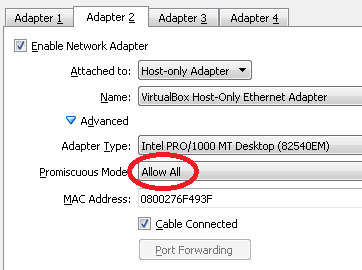
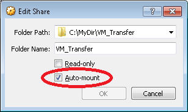

### Import the Mininet VM

* *File -> Import Appliance*
  * *Appliance to Import* (Select the `.ovf` file from the Mininet archive that you downloaded)
  * Modify number of CPUs as appropriate
  * Modify amount of memory as appropriate
  * Select *Reinitialise MAC address of all network cards*
  * *Import*

### Setup performed from the Settings menu of the VM

Right click the *VM -> Settings*
* Attach the Host-Only Adapter to the VM Adapter 2
  - *Network -> Adapter 2*
    (Ensure Promiscuous mode is set to "Allow all")

    

* Add a shared folder for convenient file transfer
  - *VM Settings -> Storage*

     

* Set up Optical drive with Guest Additions `.iso`
  - *VM Settings -> Storage*
    - Add an empty Optical Drive in *Settings -> Storage*

      

    - Choose disk

      

    - Select the Guest Additions `.iso` file from e.g.:

     `"C:\Program Files\Oracle\VirtualBox\VBoxGuestAdditions.iso"`

### NAT Network

The NAT Network Adapter mode is used by the VM to access the web and download files etc.
Adapter 1 should already be configured for NAT.
However the default network IP address assigned (typically 10.0.2.15) conflicts with the 10.0/16 IP address we have set up for the Host-Only network.
To change the IP address used by NAT, use the following command supplying an alternative IP address range (no GUI equivalent of this command is available).

```winbatch
VBoxManage modifyvm "Mininet-VM" --natnet1 "10.10/16"
```

Notes:
- If running multiple VMs, this command needs to be applied to each VM that uses this Host-Only Adaptor.
- This setting is not displayed with the `VBoxManage showvminfo Mininet-VM` command but can be seen in the VM's `.vbox` configuration file.
  (E.g. `C:\Users\<UserName>\VirtualBox VMs\Mininet-VM\Mininet-VM.vbox`)
